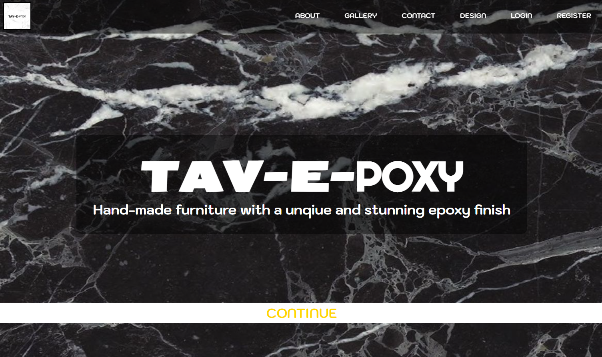
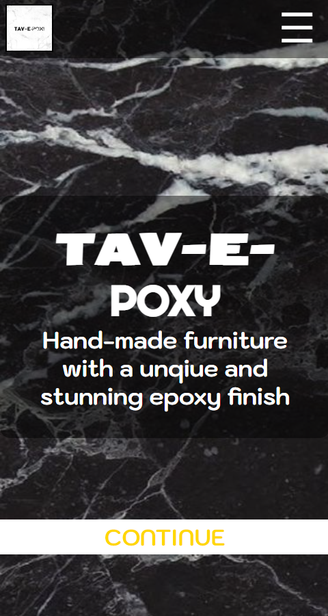

# Tav-e-poxy

<<<<<<< HEAD
CURRENTLY BEING UPDATED TO TAILWIND STYLE SHEETS

TavyEpoxy is a Devon based furniture and art based business, creating unique handmade furniture with custom artistic epoxy finishes
The site needs to look smart and artistic for a higer end client who enjoys custom furniture

Current Address [Live Tav-e-poxy Link](https://strong-tulumba-d852ca.netlify.app/)

## Table of contents

- [Tav-e-poxy](#tav-e-poxy)
  - [Table of contents](#table-of-contents)
  - [General info](#general-info)
  - [Technologies](#technologies)
  - [Run this project locally](#run-this-project-locally)

## General info

A database is not in use yet but will be and is currently found.
Server deployment with Vercel @ [https://webdesignsbytom-app.vercel.app/](https://webdesignsbytom-app.vercel.app/)

## Technologies

App developed with:

Frontend: React, JavaScript, Tailwind, Axios, validator

Backend: Express, Prisma, JavaScript

## Run this project locally

1. Fork this repository and clone the fork to your machine.
2. Navigate to client and server files and run
3. `npm install`
4. `npm start`
=======
TavyEpoxy is a Devon based furniture and art based business, creating unique handmade furniture with custom artistic epoxy finishes

The site needs to look smart and artistic for a higer end client who enjoys custom furniture

Current address `https://strong-tulumba-d852ca.netlify.app/`

[Temp Frontend](https://strong-tulumba-d852ca.netlify.app/)

## Table of contents

- [TAV-E-POXY](#tav-e-poxy)
  - [Table of contents](#table-of-contents)
>>>>>>> 428f41298850981e19b723da267c54d6952520cc
